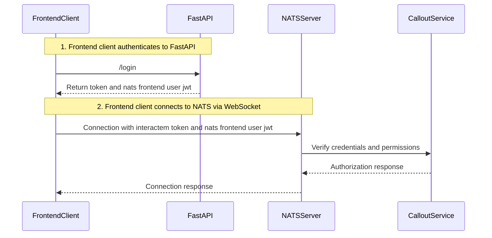

# NATS Server Config

## Security

Here we are using a variation on `delegated authentication` as shown in this example in [`callout.go`](https://github.com/aricart/callout.go/tree/837de3254dd5d6b40886930f29c502bc820414e4/examples/delegated). We use the nats [`nsc`](https://docs.nats.io/using-nats/nats-tools/nsc) tool to generate the various components required for authentication/authorization. We provide some brief descriptions of what is going on here, and link to the NATS documentation throughout.

1. We are using decentralized authentication (authN) and authorization (authZ) with NATS jwts. There is a very detailed guide about this system [here](https://docs.nats.io/running-a-nats-service/nats_admin/security/jwt).
1. First we create an `operator`.
1. Under this `operator` we create ___APP___ and ___CALLOUT___ `accounts`. `accounts` are the barrier between subjects/streams in a NATS cluster (`account A` cannot share its streams with `account B`, unless we explicitly import/export them).
    - Under the ___APP___ `account`, we create two static `users`: ___backend___ and ___operator___. ___backend___ user credentials are used in FastAPI, orchestrator, on agents, etc. ___operator___ user is used to connect the operators to our cluster. We limit the exposure of these `users` to the NATS cluster by only allowing pub/sub on certain topics (TODO).
    - Under the ___CALLOUT___ `account`, we create two static `users`: ___callout___ and ___frontend___. ___callout___ is the `user` that connects to the server inside the auth callout service [(more on this below)](#auth-callout).
1. The `operator` and each of the `accounts` also has a [`signing key`](https://docs.nats.io/using-nats/nats-tools/nsc/signing_keys). We sign the JWTs of the `accounts` with the `operator` signing key. We sign the JWTs of the `users` under the `accounts` with the account's signing key. This way, if a key escapes into the wild, we can [revoke](https://docs.nats.io/running-a-nats-service/nats_admin/security/jwt#revocations) them if needed and mint new signing keys.
1. The ___CALLOUT___ `account` also has an `XKEY` to encrypt traffic between the callout service and the NATS cluster.
1. We use the NATS [MEMORY resolver](https://docs.nats.io/running-a-nats-service/configuration/securing_nats/auth_intro/jwt/mem_resolver). This is good for a small number of accounts that don't change that often (our situation, currently). It supports configuration reload without restarting the server.

We could consider using [this](github.com/synadia-io/jwt-auth-builder.go) when it is more stable.

### Auth Callout

The ___CALLOUT___ `account` is used for [auth callout](https://docs.nats.io/running-a-nats-service/configuration/securing_nats/auth_callout). This is the flow:

1. A frontend client authenticates to FastAPI, and the ___frontend___ `user` credentials (jwt) sent back. When we created the ___frontend___ `user` we added the `--bearer` flag. On `connect`, the server sends a [nonce](https://en.wikipedia.org/wiki/Cryptographic_nonce) to the client. With bearer-only, we bypass the client-side nonce challenge, and the FastAPI token will be passed through to the [auth callout service](backend/callout/).
1. The request to connect will enter into the authorization function in the service, which verifies the FastAPI token and authorizes it to pub/sub on certain subjects. The final good-to-go is only sent back to the NATS cluster, not back to the client.

### Script artifacts

The script generates the following artifacts to `./out_jwt`:

- `auth.conf`: configuration generated after all accounts are added, imported in nats cluster configuration files
- `APP.nk`: ___APP___ `account` private NKEY. Used to extract public NKEY and assign it to users (IssuerAccount).
- `APP_sk.nk`: ___APP___ `account` signing private NKEY. Used to sign users in auth callout.
- `CALLOUT.nk`: ___CALLOUT___ `account` private NKEY. Used to sign auth callout responses.
- `CALLOUT_sk.nk`: ___CALLOUT___ `account` signing private NKEY. Currently doesn't do anything
- `CALLOUT_xkey.nk`: ___CALLOUT___ `account` encryption NKEY
- `backend.creds`: backend `user` credentials used by backend services (FastAPI, orchestrator, agents)
- `callout.creds`: callout `user` credentials used by callout service
- `operator.creds`: operator `user` credentials used by operators
- `frontend.creds`: frontend `user` credentials. Jwt loaded by FastAPI backend and sent to frontend clients. Does not have any privileges.
