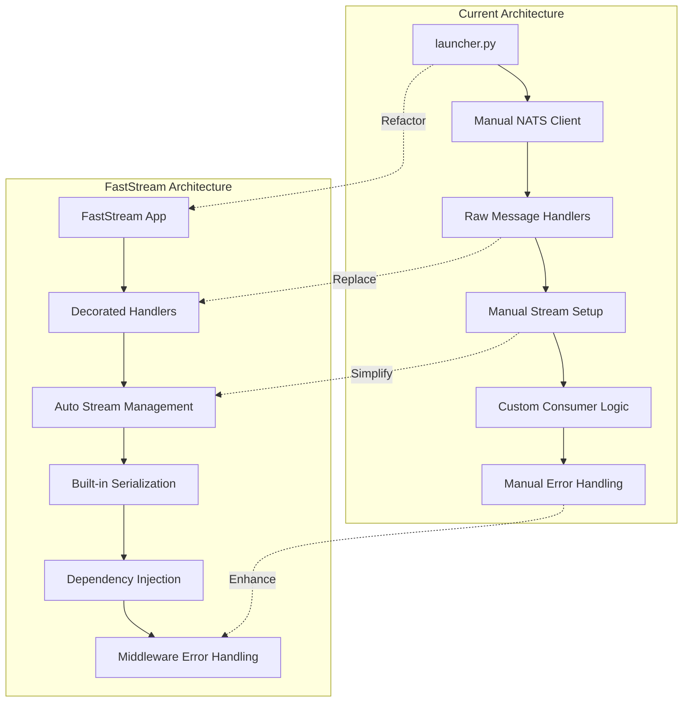

# FastStream Refactoring Plan for Launcher Microservice

## Executive Summary

This plan outlines the migration of the launcher microservice from manual NATS handling to FastStream's decorator-based approach to improve code maintainability and reduce complexity.

## Current Architecture Analysis

### Current Implementation (`backend/launcher/interactem/launcher/launcher.py`)

The launcher service currently handles:
- **NATS Microservice**: Status endpoint for machine status queries using `nats.micro`
- **Message Consumer**: Job submission processing from SFAPI stream
- **Job Monitoring**: Async job lifecycle tracking with SFAPI client
- **Notifications**: Publishing status updates and errors to NATS streams

**Key Issues with Current Approach:**
- 240+ lines of manual NATS client setup and management
- Custom message handling with explicit acknowledgment
- Manual stream/consumer creation and lifecycle management
- Tight coupling between NATS logic and business logic
- Complex error handling and retry mechanisms

## Proposed FastStream Architecture



## Implementation Plan

### Phase 1: Core Module Enhancement

#### 1.1 Add FastStream to interactem.core
**File**: `backend/core/pyproject.toml`
```toml
[tool.poetry.dependencies]
# ... existing dependencies
faststream = "^0.5"
```

#### 1.2 Create FastStream Bridge Module
**New File**: `backend/core/interactem/core/faststream.py`
```python
"""FastStream utilities for InteractEM services."""

from typing import Any, Dict
from faststream import FastStream
from faststream.nats import NatsBroker
from .config import cfg
from .logger import get_logger

logger = get_logger()

def create_nats_broker(service_name: str) -> NatsBroker:
    """Create a configured NATS broker for FastStream."""
    
    # Determine auth options based on config
    options_map = {
        cfg.NATS_SECURITY_MODE.NKEYS: {
            "nkeys_seed_str": cfg.NKEYS_SEED_STR,
        },
        cfg.NATS_SECURITY_MODE.CREDS: {
            "user_credentials": str(cfg.NATS_CREDS_FILE),
        },
    }
    options = options_map[cfg.NATS_SECURITY_MODE]
    
    return NatsBroker(
        servers=[str(cfg.NATS_SERVER_URL)],
        client_name=service_name,
        **options
    )

def create_faststream_app(service_name: str) -> tuple[FastStream, NatsBroker]:
    """Create a FastStream app with configured NATS broker."""
    broker = create_nats_broker(service_name)
    app = FastStream(broker, title=service_name)
    return app, broker
```

### Phase 2: Launcher Service Refactoring

#### 2.1 New Application Structure
**File**: `backend/launcher/interactem/launcher/faststream_launcher.py`

```python
"""FastStream-based launcher service."""

import asyncio
from contextlib import asynccontextmanager
from typing import Annotated

from faststream import FastStream, Depends
from faststream.nats import NatsBroker
from pydantic import ValidationError
from sfapi_client.client import AsyncClient as SFApiClient
from sfapi_client.compute import Machine
from sfapi_client.exceptions import SfApiError
from jinja2 import Environment, PackageLoader

from interactem.core.faststream import create_faststream_app
from interactem.core.logger import get_logger
from interactem.core.constants import (
    SUBJECT_SFAPI_JOBS_SUBMIT,
    SUBJECT_NOTIFICATIONS_ERRORS,
    SUBJECT_NOTIFICATIONS_INFO,
)
from interactem.sfapi_models import (
    AgentCreateEvent,
    JobSubmitEvent,
    StatusRequest,
    StatusResponse,
)
from .config import cfg
from .job_handler import JobHandler

logger = get_logger()

# Global dependencies
sfapi_client = SFApiClient(key=cfg.SFAPI_KEY_PATH)
jinja_env = Environment(loader=PackageLoader("interactem.launcher"), enable_async=True)
job_handler = JobHandler(sfapi_client, jinja_env, cfg)

@asynccontextmanager
async def lifespan():
    """Application lifespan management."""
    logger.info("Starting FastStream Launcher Service")
    yield
    logger.info("Shutting down FastStream Launcher Service")
    await sfapi_client.close()

# Create FastStream app
app, broker = create_faststream_app("sfapi-launcher")
app.lifespan_context = lifespan

# Dependencies
async def get_job_handler() -> JobHandler:
    """Dependency to get job handler."""
    return job_handler

@broker.subscriber(
    "sfapi.status",
    # FastStream handles request/reply pattern automatically
)
async def handle_status_request(
    request: StatusRequest,
) -> StatusResponse:
    """Handle machine status requests."""
    logger.info(f"Received status request for {request.machine}")
    
    try:
        compute = await sfapi_client.compute(request.machine)
        return StatusResponse(status=compute.status)
    except SfApiError as e:
        logger.error(f"Failed to get status: {e}")
        raise  # FastStream will handle error response

@broker.subscriber(SUBJECT_SFAPI_JOBS_SUBMIT)
async def handle_job_submission(
    message: AgentCreateEvent,
    handler: Annotated[JobHandler, Depends(get_job_handler)]
) -> None:
    """Handle job submission requests."""
    logger.info("Received job submission request")
    
    try:
        await handler.submit_job(message)
    except Exception as e:
        logger.error(f"Job submission failed: {e}")
        # Publish error notification
        await broker.publish(
            str(e),
            subject=SUBJECT_NOTIFICATIONS_ERRORS
        )
        raise  # Let FastStream handle retry logic

# Run the application
if __name__ == "__main__":
    app.run()
```

#### 2.2 Extract Job Handling Logic
**New File**: `backend/launcher/interactem/launcher/job_handler.py`

```python
"""Job handling logic extracted from main launcher."""

import asyncio
from typing import TYPE_CHECKING

from sfapi_client._models import StatusValue
from sfapi_client.exceptions import SfApiError
from sfapi_client.jobs import AsyncJobSqueue
from sfapi_client.paths import AsyncRemotePath
from pydantic import ValidationError

from interactem.core.logger import get_logger
from interactem.sfapi_models import AgentCreateEvent, JobSubmitEvent
from .constants import LAUNCH_AGENT_TEMPLATE

if TYPE_CHECKING:
    from sfapi_client.client import AsyncClient as SFApiClient
    from jinja2 import Environment
    from .config import LauncherConfig

logger = get_logger()

class JobHandler:
    """Handles job submission and monitoring logic."""
    
    def __init__(
        self, 
        sfapi_client: "SFApiClient", 
        jinja_env: "Environment", 
        config: "LauncherConfig"
    ):
        self.sfapi_client = sfapi_client
        self.jinja_env = jinja_env
        self.config = config
    
    async def submit_job(self, agent_event: AgentCreateEvent) -> None:
        """Submit and monitor a job."""
        # Convert to JobSubmitEvent
        reservation = None
        if agent_event.extra:
            reservation = agent_event.extra.get("reservation")
        
        job_submit_event = JobSubmitEvent(
            machine=agent_event.machine,
            account=self.config.SFAPI_ACCOUNT,
            qos=self.config.SFAPI_QOS,
            constraint=agent_event.compute_type.value,
            walltime=agent_event.duration,
            reservation=reservation,
            num_nodes=agent_event.num_nodes,
        )
        
        # Validate compute availability
        compute = await self.sfapi_client.compute(job_submit_event.machine)
        if compute.status != StatusValue.active:
            raise ValueError(f"{job_submit_event.machine.value} is not active: {compute.status}")
        
        # Check environment file
        try:
            remote_path = AsyncRemotePath(path=self.config.ENV_FILE_PATH, compute=compute)
            await remote_path.update()
        except (SfApiError, FileNotFoundError):
            raise ValueError("Failed to find .env file for agent startup")
        
        # Render job script
        template = self.jinja_env.get_template(LAUNCH_AGENT_TEMPLATE)
        script = await template.render_async(
            job=job_submit_event.model_dump(), 
            settings=self.config.model_dump()
        )
        
        # Submit job
        job: AsyncJobSqueue = await compute.submit_job(script)
        logger.info(f"Job {job.jobid} submitted")
        logger.info(f"Script: \n{script}")
        
        # Start monitoring in background
        asyncio.create_task(self._monitor_job(job))
    
    async def _monitor_job(self, job: AsyncJobSqueue) -> None:
        """Monitor job lifecycle."""
        logger.info(f"Job {job.jobid} has been submitted to SFAPI. Waiting for it to run...")
        
        try:
            await job.running()
        except SfApiError as e:
            logger.error(f"SFAPI Error: {e.message}")
            return
        
        await job.complete()
        logger.info(f"Job {job.jobid} has completed. Job state: {job.state}")
```

### Phase 3: Message Handler Migration

#### 3.1 Handler Comparison

| Current Implementation | FastStream Equivalent |
|----------------------|---------------------|
| Manual `consume_messages()` | `@broker.subscriber()` decorator |
| Custom `submit()` function | Decorated async handler with auto-deserialization |
| Manual `status()` RPC | `@broker.subscriber()` with automatic request/reply |
| Manual stream setup | FastStream auto-configuration |
| Custom error publishing | Middleware and built-in error handling |
| Manual acknowledgment | Automatic acknowledgment with retry |

#### 3.2 Configuration Migration

**Current**: Manual NATS client setup in `main()`
```python
# 50+ lines of manual setup
nats_client = await nc(servers=[str(cfg.NATS_SERVER_URL)], name="sfapi-launcher")
js = nats_client.jetstream()
# Manual stream creation...
```

**FastStream**: Automatic configuration
```python
# 3 lines total
app, broker = create_faststream_app("sfapi-launcher")
# Streams created automatically based on subscribers
```

### Phase 4: Testing Strategy

#### 4.1 Update Existing Tests
**File**: `backend/launcher/tests/test_faststream_launcher.py`

```python
"""Tests for FastStream launcher."""

import pytest
from faststream.testing import TestApp

from interactem.launcher.faststream_launcher import app, broker
from interactem.sfapi_models import StatusRequest, AgentCreateEvent

@pytest.mark.asyncio
async def test_status_handler():
    """Test status request handling."""
    async with TestApp(app) as test_app:
        # Test successful status request
        response = await test_app.publish(
            StatusRequest(machine="perlmutter"),
            subject="sfapi.status"
        )
        assert response.status == "active"  # or whatever expected

@pytest.mark.asyncio 
async def test_job_submission():
    """Test job submission handling."""
    async with TestApp(app) as test_app:
        # Mock job submission
        await test_app.publish(
            AgentCreateEvent(
                machine="perlmutter",
                duration="01:00:00",
                compute_type="gpu",
                num_nodes=1
            ),
            subject="sfapi.jobs.submit"
        )
        # Verify job was submitted (mock SFAPI)
```

### Phase 5: Deployment and Migration

#### 5.1 Backward Compatibility
- Keep existing NATS stream names and subjects
- Preserve message formats for cross-service compatibility  
- Maintain configuration patterns
- No breaking changes to dependent services

#### 5.2 Migration Steps

```mermaid
gantt
    title FastStream Migration Timeline
    dateFormat X
    axisFormat %d
    
    section Core Module
    Add FastStream dependency     :active, core1, 0, 1
    Create FastStream utilities   :core2, after core1, 1
    
    section Launcher Refactor  
    Create job handler class     :launcher1, after core2, 1
    Create FastStream launcher   :launcher2, after launcher1, 2
    Update entry point          :launcher3, after launcher2, 1
    
    section Testing & Cleanup
    Update tests                 :test1, after launcher3, 1
    Remove legacy code           :cleanup1, after test1, 1
```



### Phase 6: Benefits and Metrics

#### 6.1 Code Reduction
- **Before**: ~240 lines in `launcher.py`
- **After**: ~150 lines total (split across modules)
- **Reduction**: ~40% less boilerplate code

#### 6.2 Improved Features
- ✅ Type-safe message handling with Pydantic models
- ✅ Automatic serialization/deserialization
- ✅ Built-in retry mechanisms and error boundaries
- ✅ Dependency injection for testability  
- ✅ Cleaner separation of concerns
- ✅ Better integration with modern Python async patterns

#### 6.3 Maintainability Improvements
- Clear separation between NATS logic and business logic
- Easier to add new message handlers
- Better error handling and logging
- Simplified testing with FastStream test utilities
- Reduced coupling and improved modularity

## Implementation Questions

Before proceeding with implementation, please confirm:

1. **Service Name**: Should we keep "sfapi-launcher" as the service name?
2. **Message Subjects**: Are the current NATS subjects (`sfapi.jobs.submit`, etc.) final?
3. **Error Handling**: Do you want to preserve the current notification publishing pattern?
4. **Testing**: Should we maintain the existing test structure or create new FastStream-specific tests?
5. **Deployment**: Any specific deployment considerations or rollback requirements?

## Next Steps

Once approved, I will:
1. Update the core module with FastStream utilities
2. Create the new FastStream-based launcher
3. Update tests and documentation
4. Provide migration scripts if needed

This refactoring will significantly improve code maintainability while preserving all existing functionality and ensuring backward compatibility.